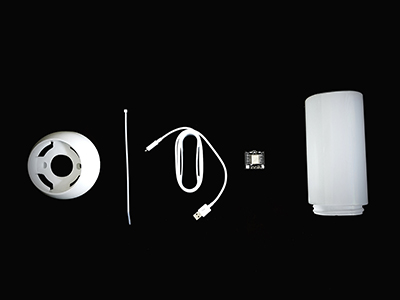
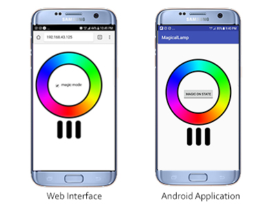

# Magical Lamp v2.0.0-a.0
Magical Lamp is a smart sleep lamp that when you go to bed, it will automatically turn on, and the color will change overnight, and it will automatically turn off when it is in the morning.
You can also control it through your smart phone with android application or web interface.
This product is completely DIY and open source.This repository contains all source code.
This product is presented at workshops held by Cafe Technology in Iran.

## DIY Feature
Magical Lamp is made up of 5 pieces, which you will connect these parts.

  

## Software Features
Magical Lamp has two modes:
- Magical mode
- Remote mode

Remote mode has below features:
- Turn on with web interface or android application
- Changing lamp's color

  

Magical mode:
- It turns on when it is dark.
- The color changes smoothly to 16 million color.

  

